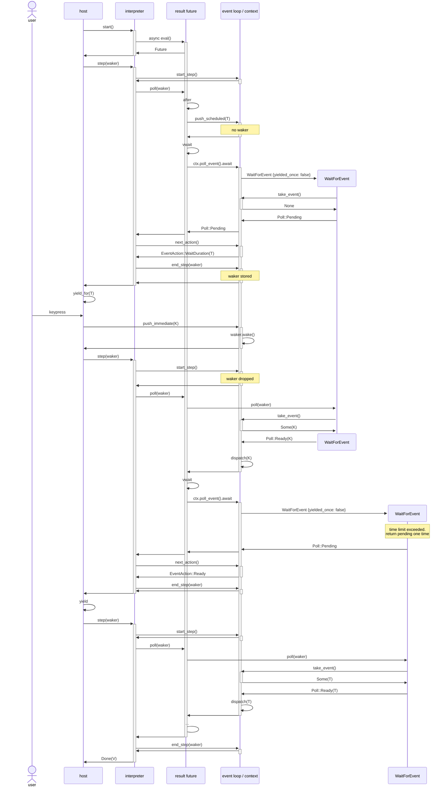

## flow: tcl-controlled loop (vwait)

```mermaid
sequenceDiagram
  actor u as user
  participant h as host
  participant i as interpreter
  participant r as result future
  participant l as event loop / context

  h ->>+ i: start()

  i ->>+ r: async eval()
  r ->> i: Future
  i ->>- h:

  h ->>+ i: step(waker)
  i ->>+ l: start_step()
  l ->>- i:
  i ->> r: poll(waker)
  r ->> r: after
  r ->>+ l: push_scheduled(T)
  note over l: no waker
  l ->>- r:
  r ->> r: vwait

  r ->>+ l: ctx.poll_event().await

  create participant w as WaitForEvent
  l ->> w: WaitForEvent {yielded_once: false}
  w ->>+ l: take_event()
  l ->>- w: None
  w ->> l: Poll::Pending

  l ->> r: Poll::Pending

  r ->> i:
  i ->>+ l: next_action()
  l ->>- i: EventAction::WaitDuration(T)
  i ->>+ l: end_step(waker)
  note over l: waker stored
  l ->>- i:
  i ->>- h:
  h ->> h: yield_for(T)

  u ->> h: keypress
  h ->>+ l: push_immediate(K)
  l ->> l: waker.wake()
  l ->>- h:

  h ->>+ i: step(waker)
  i ->>+ l: start_step()
  note over l: waker dropped
  l ->>- i:
  i ->> r: poll(waker)
  r ->>+ w: poll(waker)
  w ->>+ l: take_event()
  l ->>- w: Some(K)

  destroy w
  w ->> l: Poll::Ready(K)
  l ->> l: dispatch(K)
  l ->>- r:

  r ->> r: vwait
  r ->>+ l: ctx.poll_event().await

  create participant w2 as WaitForEvent
  l ->> w2: WaitForEvent {yielded_once: false}
  note over w2: time limit exceeded.<br/>return pending one time

  w2 ->> l: Poll::Pending

  l ->> r:
  r ->> i:
  i ->>+ l: next_action()
  l ->>- i: EventAction::Ready
  i ->>+ l: end_step(waker)
  l ->>- i:
  i ->>- h:
  h ->> h: yield
  h ->>+ i: step(waker)
  i ->>+ l: start_step()
  l ->>- i:
  i ->> r: poll(waker)
  r ->> w2: poll(waker)
  w2 ->>+ l: take_event()
  l ->>- w2: Some(T)
  w2 ->> l: Poll::Ready(T)
  l ->> l: dispatch(T)
  l ->>- r:

  r -> r: ...
  r ->>- i:
  i ->>+ l: end_step(waker)
  l ->>- i:

  i ->>- h: Done(V)
```
